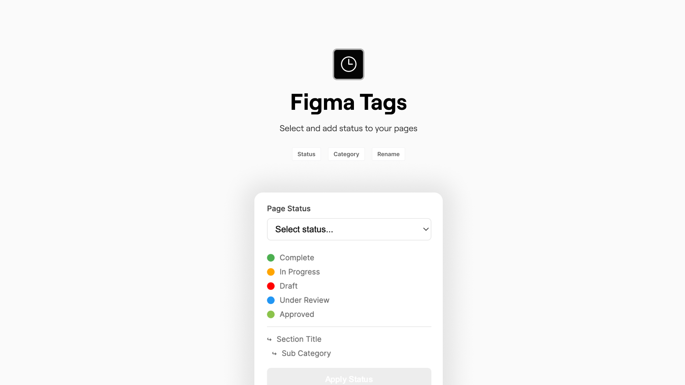

# Figma Page Status Manager

A Figma plugin that helps manage and visualize page statuses in your Figma files through visual indicators and emojis.



## Features

- 🏷️ Assign status to Figma pages
- 🔄 Update existing page statuses
- 👀 Visual indicators with emojis
- 📑 Support for section organization
- 🗂️ Persistent status storage

## Status Types

| Status | Indicator | Description |
|--------|-----------|-------------|
| Complete | 🟢 | Page is finalized |
| In Progress | 🟡 | Work in progress |
| Draft | 🛑 | Initial draft stage |
| Under Review | 👀 | Being reviewed |
| Approved | ✅ | Approved by stakeholders |
| Section Title | ↪ | Organizational section |
| Sub Category | ↪ | Sub-section marker |

## Installation

1. Open Figma
2. Go to Menu > Plugins > Development > Import plugin from manifest
3. Select the manifest.json file from this project

## Usage

1. Select a page or pages in Figma
2. Run the plugin
3. Choose desired status from dropdown
4. Click "Apply Status"

## Technical Details

- Built with Figma Plugin API
- Uses client storage for persistent data
- Handles status indicators through regex patterns
- Supports batch updates for multiple pages

## Development

The plugin consists of:
- `code.js`: Main plugin logic
- `ui.html`: Plugin UI interface
- `manifest.json`: Plugin configuration

### Storage Structure

```javascript
pageStatuses: {
  [pageId]: {
    status: string
  }
}